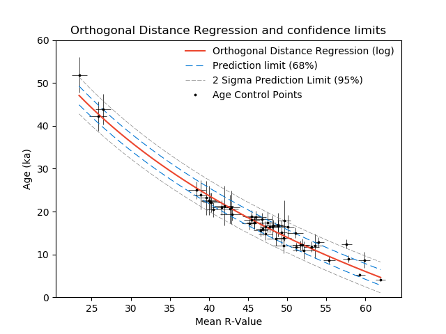

# Moraine crest or slope? An analysis of the effects of boulder position on cosmogenic exposure age
Data and code for the above paper, published in *Journal Name*, available at: www.google.com

Files include:

- Supplementary Table 1: includes 10Be sample information (n = 17).
- Supplementary Table 2: includes 36Cl sample information (n = 2).
- Supplementary Table 3: includes Schmidt hammer sample information (n = 645).
- Supplementary Description: describes the Supplementary Tables above.
- Code used for orthogonal distance regression ("ODR_code.py").

### Abstract

"Abstract goes here..."

### SHED-Earth

Our analytical approach (using Orthogonal Distance Regression) has now been implemented on SHED-Earth (http://shed.earth). Full code is available at: https://github.com/jonnyhuck/shed-earth