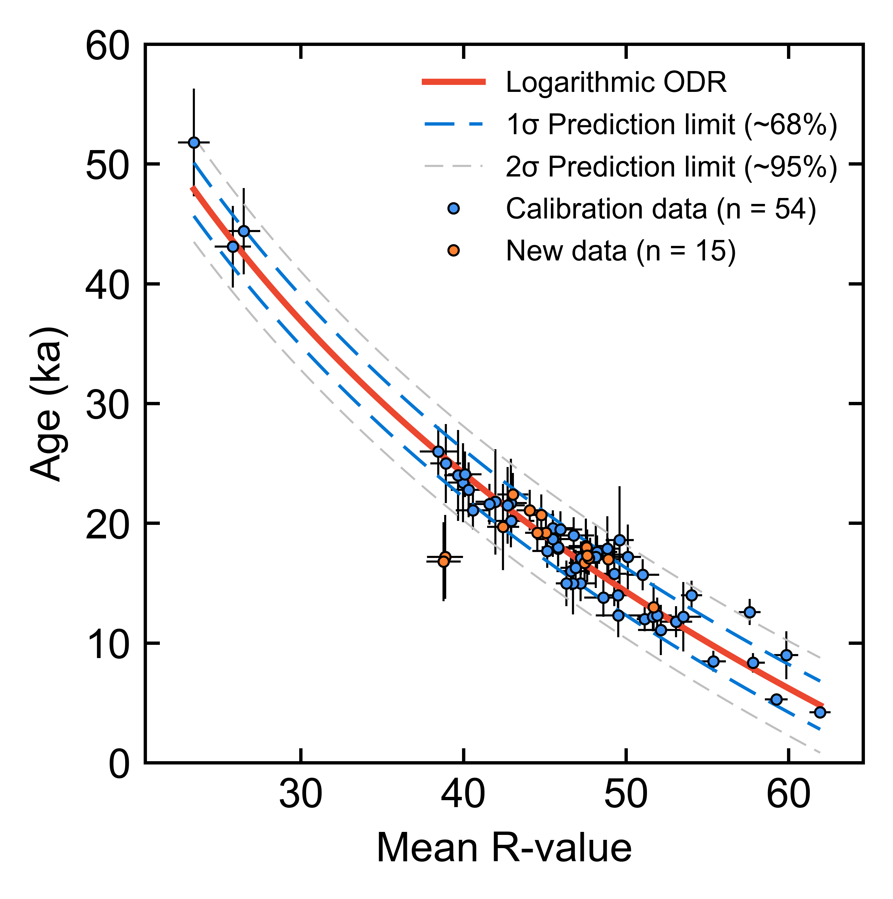

# Moraine crest or slope? An analysis of the effects of boulder position on cosmogenic exposure age
Data and code for the above paper, published in *Journal Name*, available at: www.google.com

	

**Fig.** Monte Carlo simulated Orthogonal Distance Regression of 54 TCN-SH calibration points

Folders include:

- **Data**: Supplementary tables for 10Be, 36Cl and Schmidt hammer sampled boulders
- **Code**: Python code used for Monte Carlo simulated Orthogonal Distance Regression (ODR)
- **Figures**: Latest manuscript figures 
- **Manuscript**: Latest version of the above paper (pre-peer review)

### Abstract

"Abstract goes here..."

### SHED-Earth

Our analytical approach (using Orthogonal Distance Regression) has now been implemented on SHED-Earth (http://shed.earth). Full code is available at: https://github.com/jonnyhuck/shed-earth