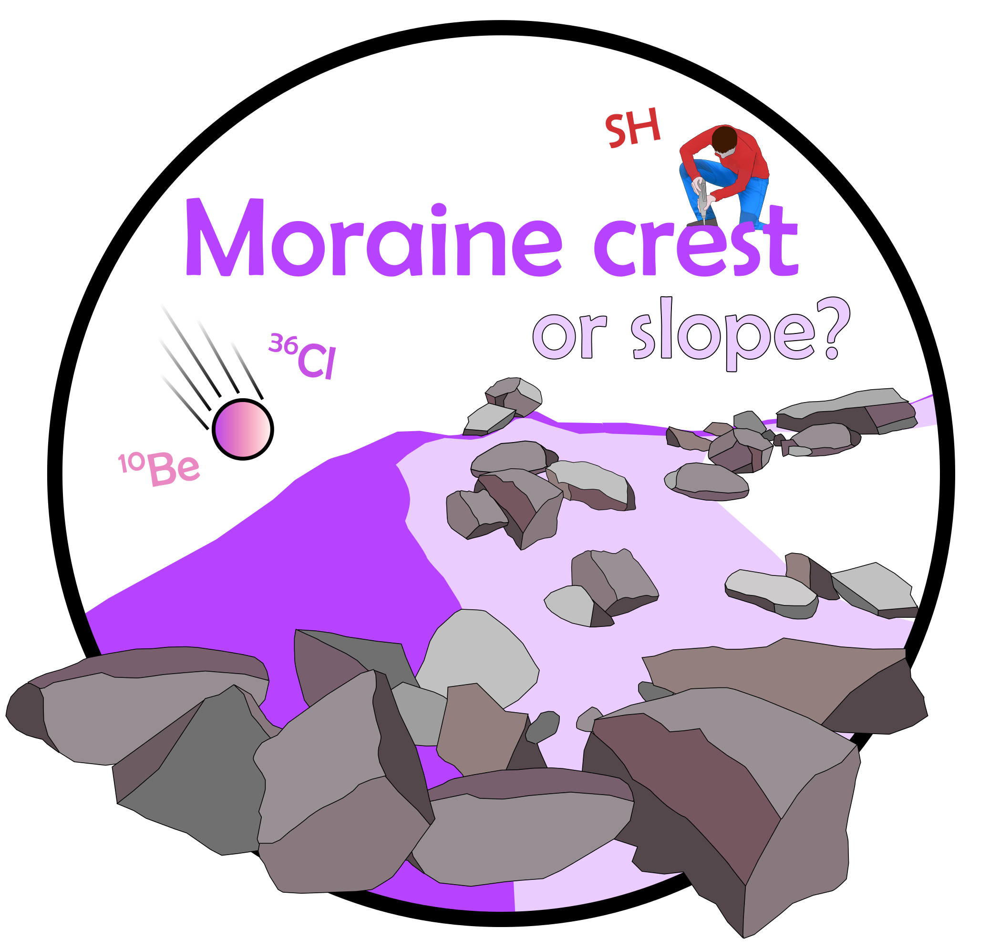

# Moraine crest or slope? An analysis of the effects of boulder position on cosmogenic exposure age
Data and code for the above paper, submitted to *Earth and Planetary Science Letters*

	

### Abstract

Terrestrial cosmogenic nuclide dating of ice-marginal moraines can provide unique insights into Quaternary glacial history. However, pre- and post-depositional exposure histories of moraine boulders can introduce geologic uncertainty to numerical landform ages. To avoid geologic outliers, boulders are typically selected based on their depositional context and individual characteristics but while these criteria have good qualitative reasoning, many have not been tested quantitatively. Of these, boulder location is critical, as boulders located on moraine crests are prioritised, while those on moraine slopes are typically rejected. This study provides the first quantitative assessment of the relative utility of moraine crest and moraine slope sampling using new and published 10Be and 36Cl ages (*n* = 19) and Schmidt hammer sampling (SH; *n* = 635 moraine boulders, ~19,050 SH *R*-values) in the northern and southern Pyrenees. These data show that for many of the studied moraines, the spatial distribution of “good” boulders is effectively random, with no consistent clustering on moraine crests, ice-proximal or -distal slopes. In turn, and in contrast to prior work, there is no clear penalty to either moraine crest or moraine slope sampling. Instead, we argue that landform stability exerts a greater influence on exposure age distributions than the characteristics of individual boulders. For the studied landforms, post-depositional stability is strongly influenced by sedimentology, with prolonged degradation of matrix-rich unconsolidated moraines while boulder-rich, matrix-poor moraines stabilised rapidly after deposition. While this pattern is unlikely to hold true in all settings, these data indicate that differences between landforms can be more significant than differences at the intra-landform scale. As ad hoc assessment of landform stability is extremely challenging based on geomorphological evidence alone, preliminary SH sampling, as utilised here, is a useful method to assess the temporal distribution of boulder exposure ages and to prioritise individual boulders for subsequent analysis.

Folders include:

- **code**: The following Python files are included:
	-  Monte Carlo simulated Orthogonal Distance Regression (*orthogonal-distance-regression.py*)
	-  Code for global and local Morans *I* spatial-autocorrelation (*moran-points.py*)
- **data**: Supplementary tables for 10Be, 36Cl and Schmidt hammer sampled boulders. Also included are:
	- Input data for the Probabilistic Cosmogenic Age Analysis Tool (P-CAAT; Dortch *et al*. 2020) and output Matlab figures (.fig)
	- Results of sensitivity testing of P-CAAT landform ages
	- Results of global and local Morans *I* spatial-autocorrelation (figures, summary statistics, and shapefiles)
- **figures**: Latest manuscript figures 
- **tables**: Latest manuscript tables, in .xls format
- **images**: Supplementary figures
- **manuscript**: Latest version of the above paper (pre-peer review)

### SHED-Earth

Our analytical approach (using Orthogonal Distance Regression) has now been implemented on SHED-Earth (http://shed.earth). Full code is available at: https://github.com/jonnyhuck/shed-earth